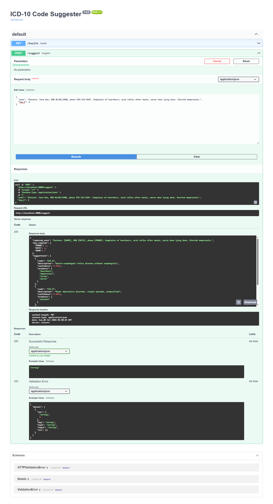

# ICD-10 Code Suggester (US Healthcare AI/ML)
   
   ## RAG layer
`POST /suggest/explain` cross-checks the classifier against retrieved coding guidelines,
flags low-agreement cases for human review, and explains the result. Works offline;
set OPENAI_API_KEY to enable LLM explanations (redacted text only, output validated
against retrieved codes).
Reads a free-text clinical note, **redacts PHI**, and suggests ICD-10-CM codes with
confidence scores and the evidence terms behind each suggestion (explainable, coder-in-the-loop).

## Run
    pip install -r requirements.txt
    python train.py                      # trains + saves model.joblib
    uvicorn icd_suggester.api:app --reload
    curl -X POST localhost:8000/suggest -H 'content-type: application/json' \
      -d '{"note":"Patient: Jane Roe, 01/02/2024, heartburn, acid reflux after meals, omeprazole"}'
    python cli.py "wheezing, albuterol inhaler"    # no server needed
    pytest -q                                      # tests (unittest also works)
    docker build -t icd-suggester . && docker run -p 8000:8000 icd-suggester

## JD coverage
Python, Pandas/NumPy/scikit-learn stack, NLP (TF-IDF n-grams), feature engineering, model
evaluation (accuracy / macro-F1), REST API + JSON, Git/tests/CI (GitHub Actions), Docker,
HIPAA-minded design (PHI redaction, no raw-note storage, synthetic data only).

## Next steps (to impress in interviews)
- Replace synthetic data with de-identified notes (MIMIC-IV); expect much lower scores.
- Swap TF-IDF for ClinicalBERT / Hugging Face embeddings; add an LLM + RAG layer over the full ICD-10-CM index.
- Add FHIR `Condition` output, Postgres audit log, MLflow tracking, drift monitoring.
- Add NER-based PHI detection (Presidio) on top of the regex rules.

## Limits
Trained on templated synthetic notes, so reported scores are optimistic. Not for clinical or billing use.
